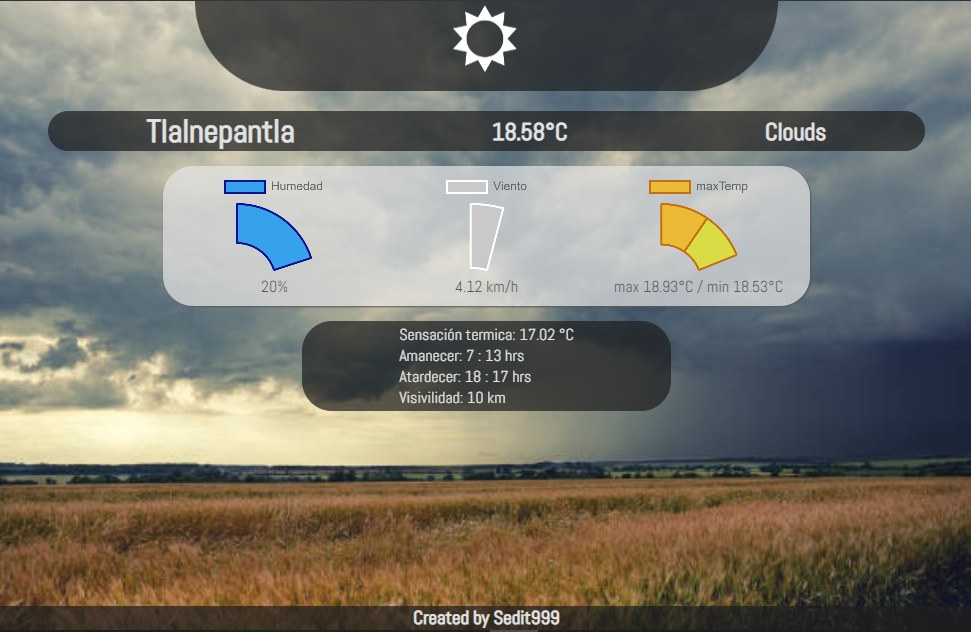
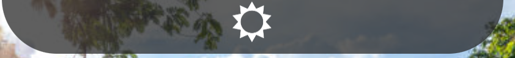
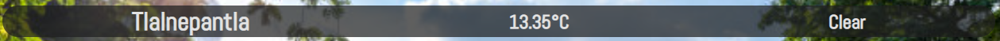
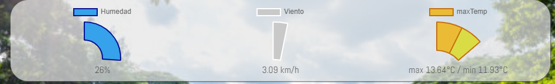
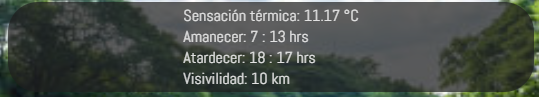
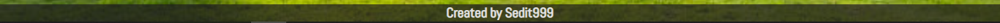

# Dashboard 

Este dashboard despliega de una manera simple datos acerca del clima de tu localidad.

Checa aquí la página => https://sedit999.github.io/DASHBOARD-clima/

Para hacer uso de esta aplicación es necesario que des permiso para acceder a tu ubicación.

    -Si diste permiso pero no te entregó datos, refresca la página de nuevo.
    -Si estás en celular es necesario que actives la ubicación del celular además de dar el permiso para acceder a la ubicación 

El backgroun de esta app cambia según el clima que esté en ese momento.

## Para empezar
---
Al entrar a la página se te pedirá que des permiso para acceder a tu ubicación.
Si al dar permiso no te mostró ningún dato y sólo dice "undefined" no te preocupes espera unos segundos y la página debería empezar a cargar sola, si no lo hace recarga la página manualmente y deberían aparecer los datos.

Mientras esperas que carguen los datos en el `header` se mostrará la leyenda *"Cargando..."*.

Al terminar de cargar, si se encontraron los datos la leyenda cambiará por el logo de la página.

En la primer parte del `main` de la página del lado izquierdo se encuentra el nombre de tu ubicación,
en el centro la temperatura y a la derecha el tipo de clima (en inglés este último).

En la siguiente sección se muestran gráficas que indican: del lado izquiero la humedad en color azul, en el centro la velocidad del viento en color gris y a la derecha la temperatura máxima comparada con la mínima en color naranja y amarillo respectivamente.

La última parte del `main` incluye una pequeña lista de datos adicionales como lo son: sensación térmica, la hora del amanecer, la hora del atardecer y la distancia de la visibilidad.

El `footer` es simple y sólo muestra quién creó la página.

El diseño para dispositivos móviles incluye la misma cantidad de datos y se muestra de la siguiente manera.
